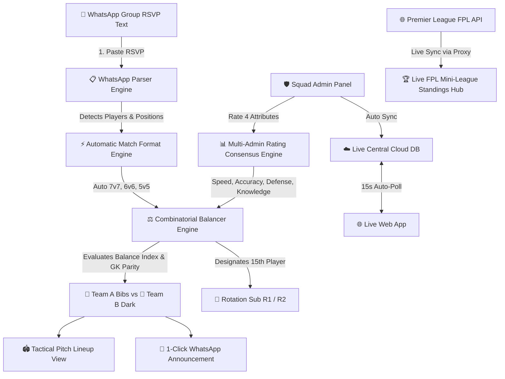

# ⚽ FC Calle Munde - Football Team Balancer & Squad Hub

An automated web application built for **FC Calle Munde** to manage weekly 7v7 football matches, balance team skill ratings, parse WhatsApp RSVPs, calculate multi-admin player ratings across 4 attributes (Speed, Accuracy, Defense, Game Knowledge), manage live group **Fantasy Premier League (FPL)** standings, and display FUT-style collectible player cards.


---

## 📐 System Architecture Diagram



---

## ✨ Key Features

### 1. 🏆 Live FPL Fantasy Premier League Hub (League ID: `889829`)
- **Direct FPL Integration:** Live connection to official Premier League servers for mini-league **"Calle Munde Before Kickoff"** (ID: `889829`).
- **Live Leaderboard:** Displays real-time standings for all 14 group managers (*Anurag*, *Vishnu*, *Himanshu*, *Jitu*, *Bharath*, *Manthan*, *Arpit*, *Karan*, *Srijan*, *Anas*, *Vinay*, *Pulkit*, *Pranjul*, *Vishal*).
- **Leader & GW Spotlight:** Automatically highlights current group leaders and top gameweek scorers.
- **Configurable League ID:** Changeable anytime in the Settings tab for future FPL seasons.

### 2. 📱 EA Sports FC Obsidian Glass & Floating Mobile App Dock
- **Mobile-First Navigation:** Features an iOS/Android style floating bottom dock for 1-thumb tab switching between **Generator**, **FPL**, **Squad**, **Admin**, **Media**, and **Config**.
- **Obsidian Dark Palette:** Deep background (`#070a11`), stadium glass cards (`backdrop-filter: blur(20px)`), neon pitch emerald (`#10b981`), and liquid gold accents (`#f59e0b`).
- **🎴 FUT-Style Player Cards:** Position color-coded glow borders (GK: Gold 🧤, DEF: Cyan 🛡️, MID: Emerald ⚙️, FWD: Magma Pink ⚡) and 4-attribute stat progress meters.

### 3. ⚡ Automatic Team Balancer & Match Format Engine
- **Combinatorial Balancing:** Evaluates player skill parity, goalkeeper distribution, and offensive balance to produce a **Balance Index (e.g. 98%)**.
- **Auto Format Selection:** Detects squad size and adjusts automatically:
  - 14 players $\rightarrow$ **7v7**
  - 15 players $\rightarrow$ **7v7 + 1 Rotation Sub (R1)**
  - 16 players $\rightarrow$ **7v7 + 2 Rotation Subs (R1/R2)**
  - 12 players $\rightarrow$ **6v6** | 10 players $\rightarrow$ **5v5**
- **Floating Reserve Manager (R1/R2):** Automatically detects designated reserve tags or assigns the last player on WhatsApp RSVP as rotation sub `R1`.

### 4. 🤝 Multi-Admin Parameterized Player Ratings
Rates players across 4 core attributes (scale 1.0 to 10.0):
- ⚡ **Speed** (Pace & Mobility)
- 🎯 **Accuracy** (Passing & Shooting Precision)
- 🛡️ **Defense** (Tackling, Positioning & Interceptions)
- 🧠 **Game Knowledge** (Tactical Awareness & Decision Making)

$$\text{Single Admin Rating} = \frac{\text{Speed} + \text{Accuracy} + \text{Defense} + \text{Game Knowledge}}{4}$$

$$\text{Final Player Rating} = \frac{\sum_{i=1}^N \text{Admin}_i \text{ Score}}{N}$$

### 5. 📸 Instagram Community Channel Hub
- Embedded link to the official FC Calle Munde Instagram: **[@callemunde](https://www.instagram.com/callemunde)**.
- Highlight cards for weekly match reels, Man of the Match voting, and turf slot announcements.

### 6. 🔒 Squad Admin Panel Security
- Admin Panel gated with secure authentication.
- Multi-admin rating submissions, DP updates, and roster modifications are locked behind admin authorization.

---

## 🛠️ Technology Stack

- **Frontend:** HTML5, CSS3 Glassmorphism System, Vanilla JavaScript (ES6+)
- **APIs:** Official Premier League FPL REST API, JSON REST Cloud DB
- **Typography & Icons:** Outfit & Inter Google Fonts, Lucide Icon Set
- **Data Persistence:** Browser `localStorage` + REST Cloud Storage API Sync
- **Deployment:** Netlify & GitHub Pages

---

## 🚀 Local Development Setup

To run the application locally on your computer:

1. Clone this repository:
   ```bash
   git clone https://github.com/jittujadav/fc-calle-munde.git
   cd fc-calle-munde
   ```

2. Start a local HTTP server:
   ```bash
   python3 -m http.server 8080
   ```

3. Open your browser and navigate to:
   ```text
   http://localhost:8080
   ```

---

## 🌿 Git Branching & Merge Workflow

To maintain code quality and prevent direct unreviewed commits on `main`:

1. **Feature Branch:** All new features or UI updates are developed on a separate branch:
   ```bash
   git checkout -b feature/<feature-name>
   ```
2. **Local Preview & Review:** Test locally on `http://localhost:8080` and obtain user review.
3. **Push & Merge:**
   ```bash
   git push -u origin feature/<feature-name>
   git checkout main
   git merge feature/<feature-name>
   git push origin main
   ```

---

## 📄 License

Distributed under the MIT License. Built for **FC Calle Munde** ⚽.
